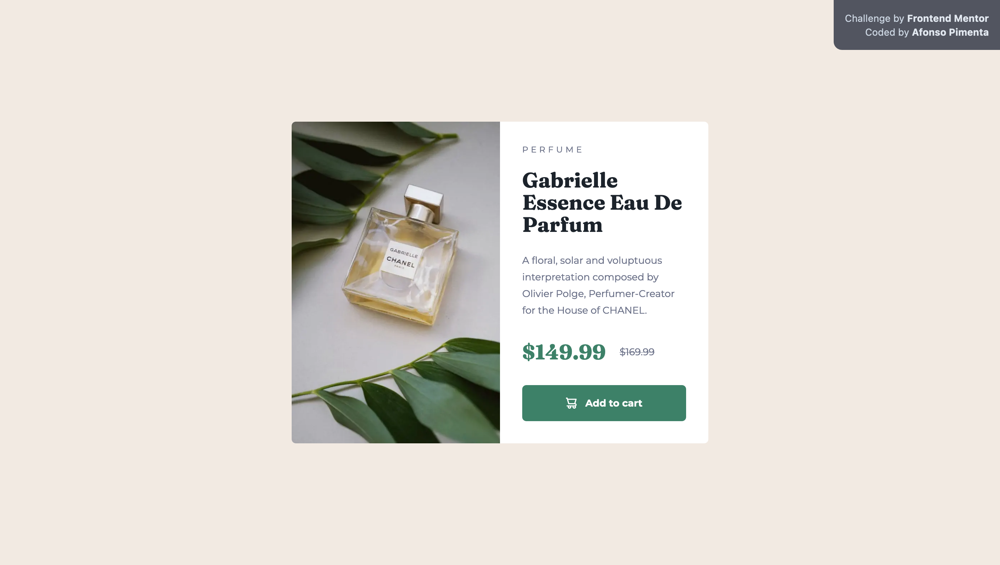

# Frontend Mentor - Product preview card component solution

This is a solution to the [Product preview card component challenge on Frontend Mentor](https://www.frontendmentor.io/challenges/product-preview-card-component-GO7UmttRfa).



## Links

- Solution URL: [undefined](#)
- Live Site URL: [undefined](#)

## Built with

This project was built using Next.js and tailwindcss.
If you want to run this website locally, you can clone this repository and run the following commands:

```bash
  npm install
  npm run dev
```

## Author

- Website - [afonsopimenta.github.io](https://afonsopimenta.github.io)
- Github - [@afonsopimenta](https://github.com/afonsopimenta)
- Frontend Mentor - [@afonsopimenta](https://www.frontendmentor.io/profile/afonsopimenta)
